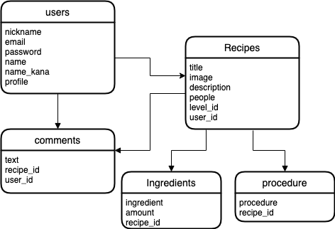

# アプリ名
CampRecipe

 

# 概要
　キャンプなどの野外で行う料理のレシピを共有するサービスです。

# URL

ログイン情報(テスト用)
- email:test@example
- test11

# 制作背景（意図）
　趣味であるキャンプを通じて感じた課題を解消すべくこのアプリケーションを制作した。

### 現状  
- キャンプの料理を調べると凝った料理が多く、材料や調味料でが多くキャンプなど野外に持っていく荷物が増える。
- 現在存在しているサイトは、運営側のみが投稿できるキャンプレシピサイトしか存在しない。
- レシピを他者と共有する専用のアプリケーション(クックパッドの様な)が存在しない。

### 課題、問題点  
- 家庭用のレシピサイトなどでレシピを探すが、家庭用なので材料や調味料などが増えてしまう
- レシピを他者と共有するサイトがなく、キャンプ初心者などがレシピを考えにくい

### 解決策
- ユーザーがキャンプレシピを共有でき、さらにレシピを難易度別にわけ、初心者から上級者まで幅広く利用できるサービスの制作

# 機能一覧(現在)
- ユーザー登録（gem devise）
- ログイン、ログアウト機能(gem devise)
- レシピ投稿機能
- レシピ一覧表示機能
- レシピ詳細機能
- レシピ編集機能

# 実装予定の機能
- レシピ削除機能
- コメント投稿機能
- コメント一覧表示機能
- コメント削除機能
- レシピいいねお気に入り機能
- 検索機能
- お気に入り一覧表示機能
- 難易度別表示機能
- ハッシュタグ機能

# 使用技術
## フロントエンド
- HTML
- CSS(SCSS)
- Bootstrap4
- Javascript

## バックエンド
- Ruby2.6.5
- Ruby on Rails 6.0.3.4

## データベース
- MySQL2 MariaDB

## ソース管理
- GitHub, GitHubDesktop

# テーブル設計

## users テーブル

| Column             | Type    | Options                       |
| ------------------ | ------- | ----------------------------- |
| nickname           | string  | null: false                   |
| email              | string  | null: false, uniqueness: true |
| encrypted_password | string  | null: false                   |
| name               | string  | null: false                   |
| name_kana          | string  | null: false                   |

### Association

- has_many :recipes
- has_many :comments

## recipes テーブル

| Column      | Type       | Options                        |
| ----------- | ---------- | ------------------------------ |
| title       | string     | null: false                    |
| description | text       | null: false                    |
| people      | string     | null: false                    |
| level_id    | integer    | null: false                    |
| user_id     | references | null: false, foreign_key: true |

### Association
- belongs_to :user
- has_many :comments
- has_many :ingredients
- has_many :procedures

## ingredients テーブル

| Column     | Type       | Options                        |
| ---------- | ---------- | ------------------------------ |
| ingredient | string     | null: false                    |
| amount     | string     | null: false                    |
| recipe_id  | references | null: false, foreign_key: true |

### Association
- belongs_to :recipe

## procedures テーブル

| Column    | Type       | Options                        |
| --------- | ---------- | ------------------------------ |
| procedure | text       | null: false                    |
| recipe_id | references | null: false, foreign_key: true |

### Association
- belongs_to :recipe

## comments テーブル

| Column    | Type       | Options                        |
| --------- | ---------- | ------------------------------ |
| text      | string     | null: false                    |
| recipe_id | references | null: false, foreign_key: true |
| user_id   | references | null: false, foreign_key: true |

### Association
- belongs_to :user
- belongs_to :recipe

# ER図
